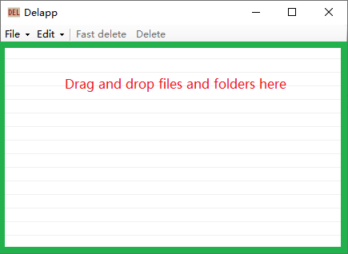
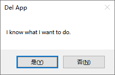
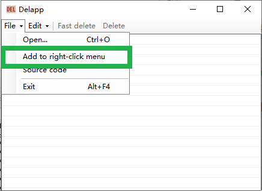
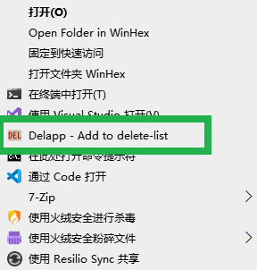
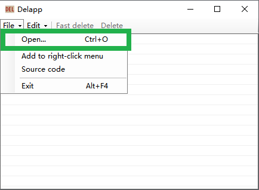
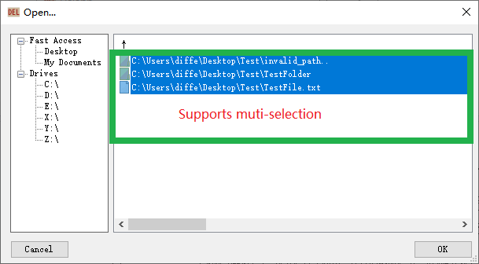
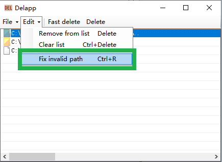

# Delapp

[简体中文](./README_cn.md)

A simple tool to delete files and folders in Windows.

## Requirement

- Windows 7 or later
- [.NET Framework 4.8 Runtime or later](https://dotnet.microsoft.com/zh-cn/download/dotnet-framework/net48)

## Getting Started

Delapp is a single-file app, no installation required, just [download latest release version](https://github.com/differentrain/Delapp/releases/latest/download/Delapp.zip), and extract it into wherever you want.



Drag and drop files or folders into the delete-list, and click `Fast delete` button or `Delete` button, a dialogue box will pop up on the screen.



Click `YES` , all the files and folders in delete-list will be deleted. The deleted items will **NOT** be moved to the recycle bin, so if you want to restore them, you must rely on other software.

As a supplementary explanation, The objects which are Dragged and dropped on the icon of Delapp, will be add to the delete-list too.

## Right-click Menu



Click `File` -- `Add to right-click menu` to add/remove Delapp into right-click context menu of explorer.

Then you can add the files or folders by right-clicking the target objects and selete the `Delapp - add to delete-list` menu.



Note that if you move Delapp to a new location, you should add right-click menu again.

## Invalid Pathes

One of my motivations for writing this app is that some folders contains invalid chars can not be deleted easily.

Open the Command Prompt, and try to create a folder end with `..` :

```
md test..\
```

Then you get a folder named `test..`, which can not be deleted in general ways.

Don't worry,  this command chould remove the tiresome folder:

```
rd test..\
```

Or you can use Delapp.



Click `File` -- `Open` menu, or press `Ctrl+O`, selete the files/folders you want to delete on right, then you can add them into delete-list.



If the 'bad' folder contains files that you still needed, you can choose it in delete-list, and click `Edit` -- `Fix invalid path`, or press `Ctrl+R`, Delapp will fix the invalid path automatically. 



## The Difference Between `Fast delete` and `Delete`

Basically, `Fast delete` is faster than `Delete`. 

On most occasions, `Fast delete` is enough, but in some case, `Fast delete` is not satisfying.

Delapp can remove occupied files - files opened by other programs, or executable files of running programs, and it's 'dll'.

`Fast delete` powers by [Restart Manager](https://learn.microsoft.com/en-us/windows/win32/RstMgr/restart-manager-portal), which could find the programs or services that occupy the target files.

Unfortunately, Restart Manager can not process the **folder** opened by other programs, although this is not a common case, but a more comprehensive way is still necessary : `Delete` is slower than `Fast delete`, but is checks all process to find file occupancies.

Another potential problem of `Fast delete` is that it uses recursion to traversal folders. The maximum length of path is 32767 characters, so the value of maximum directory depth in theory may be very large. So if you got `StackoverflowException`, try `Delete` instead of `Fast delete`.

## Translations

I would be grateful if you could help me to translate Delapp to your own language. 

You can pull a request to submit the translated version:

- Create a new class derived from `DelApp.Locals.AppLanguageProvider`
- Let `abstract string TwoLetterISOLanguageName` property returns the [ISO 639-1 two-letter or ISO 639-3 three-letter code](https://learn.microsoft.com/en-us/dotnet/api/system.globalization.cultureinfo.twoletterisolanguagename?view=netframework-4.8)
- Let `abstract int LCID` property returns the [culture identifier](https://learn.microsoft.com/en-us/dotnet/api/system.globalization.cultureinfo.lcid?view=netframework-4.8) for the target language
- Implement other members which returns relevant translated string.
- Modify `StartApp()` method in `DelApp.Program` class, add this code : `YourLanguageProvider.Instance.Register();`

Or you can also open a new issue directly to give me your translation.
