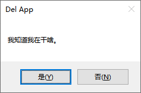
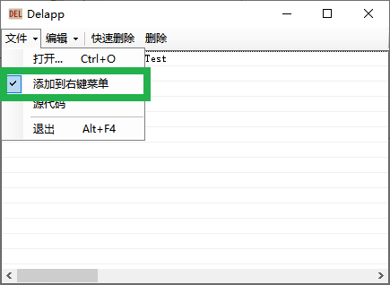
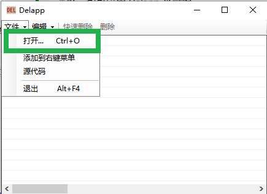
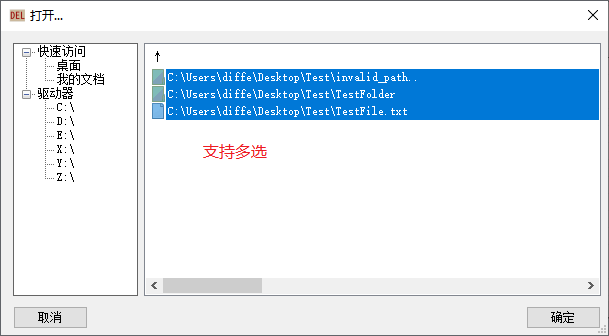
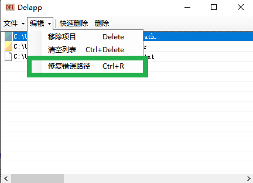

# Delapp

Windows下删除文件和文件夹的简易工具。

## 需求

- Windows 7或更高
- [.NET Framework 4.8 运行时](https://dotnet.microsoft.com/zh-cn/download/dotnet-framework/net48)或更高

## 开始使用

Delapp 免安装的单文件应用。[下载最新版本](https://github.com/differentrain/Delapp/releases/latest/download/Delapp.zip) 并解压到希望的位置即可。


拖拽文件或文件夹到待删除列表, 点击 `删除` 或 `快速删除` 按钮之后，会弹出一个提示对话框。



选择 `是` , 待删除列表中的所有文件和文件夹都会被删除。被删除的项目**不会**被移动到回收站，必须借助其他软件才能恢复它们。

另外，直接把目标文件或文件夹拖拽到程序图标上面，也可以将它们加入到待删除列表。
 
## 右键菜单



单击 `文件` -- `添加到右键菜单`， 可以在文件资源管理器的右键菜单中添加/移除 Delapp。

你可以通过右键菜单，来将目标文件和文件夹添加到待删除列表中。


注意：如果在之后改变了 Delapp 的路径，则应该再次添加右键菜单。

## 无效路径

我写这个程序的动机之一就是想要删除那些路径中含有错误字符的文件夹。

打开命令行，尝试建立一个以 `..` 结尾的文件夹：

```
md test..\
```

当 `test..` 目录创建后, 你会发现常规方式根本删不掉它。

不过没事, 用以下命令可以把这倒霉玩意儿删掉：

```
rd test..\
```

当然，也可以用 Delapp 来删除。



单击 `文件` -- `打开` 菜单, 或使用快捷键 `Ctrl+O`, 在右侧选中要删除的文件和文件见，将它们添加到待删除列表后删除即可，



如果“坏”文件夹里还有有用的文件，则可以选中这个文件夹，然后单击 `编辑` -- `修复错误路径`, 或使用快捷键 `Ctrl+R`, Delapp 会自动修复其路径问题。 



## `快速删除` 和 `删除` 的差别

总体上， `快速删除` 的速度比 `删除` 要快。 

大多数情况下使用 `快速删除` 就足够了。但在少数场景中，`快速删除` 仍有一些不足之处。

Delapp 可以删除被占用的文件 ―― 被其他程序打开的文件，正在运行中的程序及其“dll”。

`快速删除` 通过[重新启动管理器](https://learn.microsoft.com/en-us/windows/win32/RstMgr/restart-manager-portal)来获取文件的占用者。但不幸的是，重新启动管理器无法处理被占用的文件夹――尽管这个场景非常罕见，但依然需要有相关的处理方案：`删除` 功能的速度更慢，因为它会遍历所有程序，来获取占用情况。

`快速删除` 的另一个潜在问题在于它以递归的方式遍历文件夹。Windows下路径的最大长度为 32767，这意味着目录的深度可能会非常大，所以在遇到堆栈溢出错误时可以尝试 `删除` 功能。
